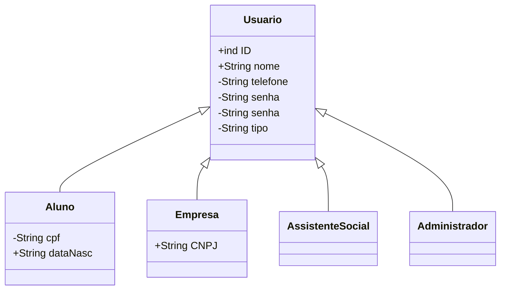

```mermaid
classDiagram    
    Usuario <|-- Aluno
    Usuario <|-- Empresa
    Usuario <|-- Assistente Social
    Usuario <|-- Administrador

    class Usuario {
        +ind ID
        +String nome
        -String telefone
        -String senha
        -String senha 
        -String tipo
    }
    class Empresa{
        +String CNPJ
    }
    class Aluno{
        -String cpf
        +String dataNasc
    }
   
   
```
